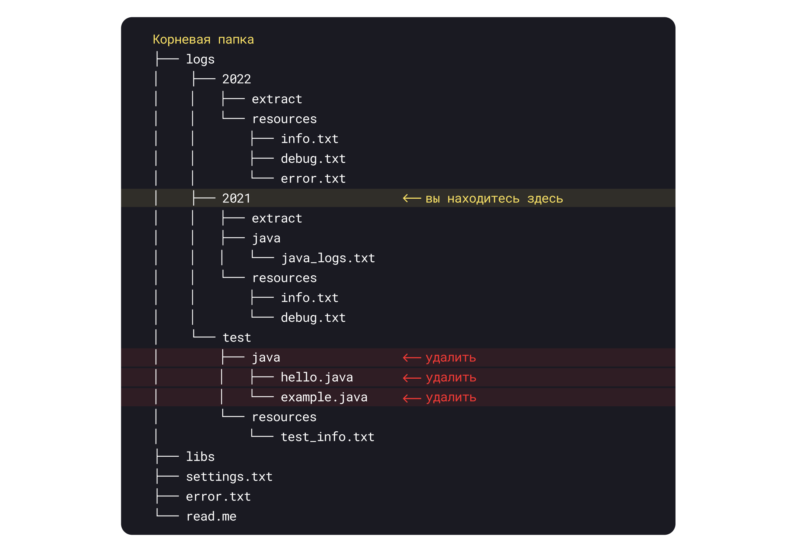

# Квиз

💡 Для выполнения этого и следующего задания советуем воссоздать предлагаемую структуру файлов у себя на компьютере и
потренироваться самостоятельно управлять файлами и директориями. Если захотите начать сначала — пересоздайте контейнер.

Дана следующая структура файлов:

* В корневом каталоге папки `libs` и `logs`, а также файлы `settings.txt` и `read.me`.
* В папке `logs` три директории: `2021`, `2022` и `test`.
* В папке `test` лежат папки `java` и `resources`.
* Папка resources пустая.
* В папке `java` только два файла — `hello.java` и `example.java`.

Вы находитесь в папке `2021`. Как удалить директорию `java` и файлы `hello.java` и `example.java`?



**a)**
```shell
rm java -r
```

**b)**
```shell
cd /
rm -r logs/test/java
```

**c)**
```shell
cd /logs/test
rm java -r
```

**d)**
```shell
cd ../test/java
rm hello.java example.java
cd ..
rm java -r
```